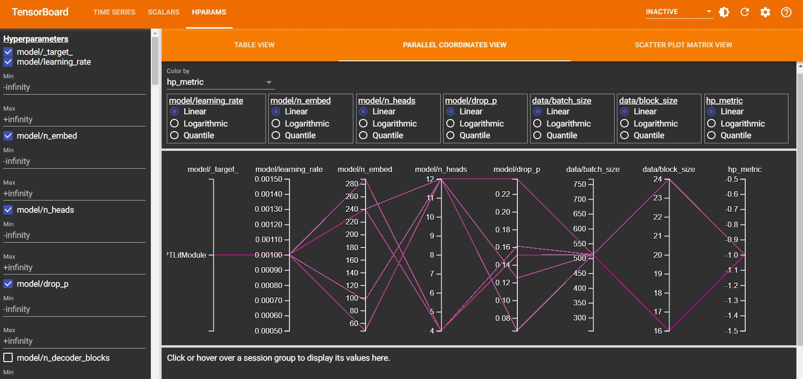

# Custom GPT model on Harry Potter Books


## Features
- Dataset used: <a href="https://github.com/formcept/whiteboard/raw/master/nbviewer/notebooks/data/harrypotter/" target="_blank">Harry Potter Books</a>
- Uses <a href="https://github.com/openai/tiktoken" target="_blank">TikToken</a> tokeniser to encode the data, a tokeniser used with OpenAI's models.
- Model training and evaluation done using Pytorch Lightning.
- Experiments configuration controls done using Hydra.
- Hyperparameter tuning done using Hydra <a href="https://hydra.cc/docs/plugins/optuna_sweeper/" target="_blank">Optuna Sweeper plugin</a>. 
- Best Learning Rate and Best Batch size to start training found using Tuner of Pytorch Lightning.


## Steps to follow
```
## Use below commands to run in the terminal. 
## To run in python or colab code cell, use '!' before every command to make the commands run in terminal. 

# 1. Clone the project repo: 
git clone https://github.com/AKJ21/gpt-lightning-template.git gpt

# 2. Get to the root folder of the project
cd gpt

# 3. Install required libraries and setup
pip install -r requirements.txt && pip install -e .

# 4. Train GPT model
# "-m" enables multirun.
# Hyperparameters space defined inside optuna cofig file which is called using "hparams_search=gpt_optuna"
# Data, model, train, and other configurations overridden using "experiment=gpt".
# For logging, we are using aim, mlflow, tensorboard which are called using "logger=many_loggers".

copper_train -m hparams_search=gpt_optuna experiment=gpt data.num_workers=16 logger=many_loggers

## 5. Experiment tracking
aim up
```

Default trainer is set to auto. If want to use CPU/GPU, you can mention as below:
- For CPU: `copper_train -m hparams_search=gpt_optuna experiment=gpt data.num_workers=16 logger=many_loggers trainer=cpu`
- For GPU: `copper_train -m hparams_search=gpt_optuna experiment=gpt data.num_workers=16 logger=many_loggers trainer=gpu`

## Check complete parameters list
```
# 1. Default parameters
copper_train --help

# 2. Specific experiment parameters
copprt_train experiment=gpt --help
```

### TensorBoard Hparams Results Comparison
Shown the comparison of validation accuracy and validation loss for different hyper perameters.




## Best Param Run 
```
! copper_train -m experiment=gpt_best_params data.num_workers=16 logger=many_loggers

```

## Contributors
- Aman Jaipuria
- Anurag Mittal
